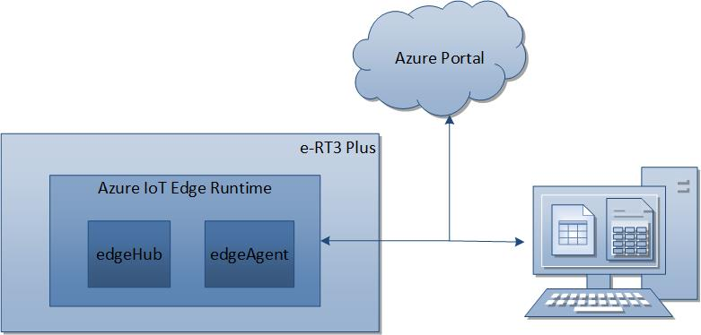
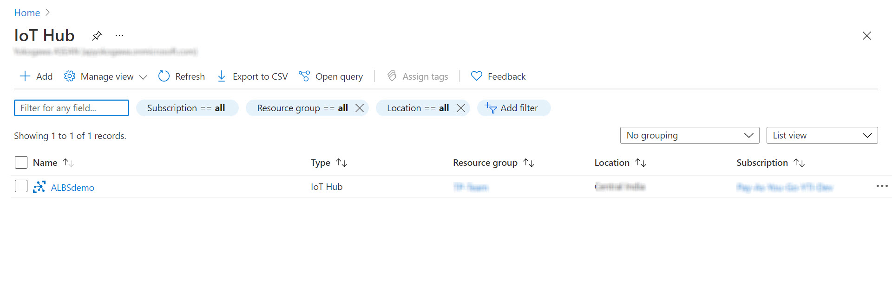

# Deploying Azure Runtime Environment on e-RT3 Plus

## Introduction

Azure IoT Runtime enables you to collect information and execute commands on Edge devices remotely. When installed on e-RT3 Plus, the features of both e-RT3 Plus and Azure Runtime Environment can be utilized to create a variety of applications.

This is part one of a three-part series on using Azure Runtime Environment and e-RT3 Plus together to create bespoke solutions. In this article, we will demonstrate how to deploy Azure Runtime Environment on the e-RT3 Plus device.



To deploy Azure IoT Edge Runtime on e-RT3 Plus device, configuration must be performed both on the e-RT3 Plus and Azure Cloud. First, the Azure Runtime Environment is installed on e-RT3 Plus by executing commands through an SSH terminal. Once this is done, an IoT Hub is set up on Azure Portal and an Edge device is registered in it. Finally, the e-RT3 Plus and the Edge device in the Azure portal are connected using a connection string and the IoT Edge module is deployed to e-RT3 Plus.

## Workflow

The following figure shows the workflow for deploying Azure Runtime Environment on e-RT3 Plus.


## Prerequisites

Before you start this tutorial, the following prerequisites must be met:

1. e-RT3 Plus Edge device must be available.
2. An active [Azure Subscription](https://azure.microsoft.com/en-in/pricing/purchase-options/pay-as-you-go/) is required. This subscription must include access to Azure PowerShell and IoT Hub.

---

## Getting Started

Deploying Azure Runtime Environment to the e-RT3 Plus involves the following steps:

1. [Install Azure IoT Edge Runtime on e-RT3 Plus](#install-azure-iot-edge-runtime-on-e-rt3-plus).
2. [Create an IoT Hub on Azure Portal](#create-an-iot-hub-on-azure-portal)
3. [Register an Edge device on the IoT Hub](#register-an-edge-device-on-the-iot-hub)
4. [Connect IoT Runtime on e-RT3 Plus to Azure IoT Hub](#connect-iot-runtime-on-e-rt3-plus-to-azure-iot-hub)
5. [Configure deployment on Azure](#configure-deployment-on-azure)
6. [Verify deployment](#verify-deployment)

### Install Azure IoT Edge Runtime on e-RT3 Plus

To support the operation of the Azure IoT Edge modules, Azure IoT Edge Runtime must be installed.

Follow these steps to install Azure IoT Edge Runtime on e-RT3 Plus:

1. Open an SSH terminal to the e-RT3 Plus device.

2. Prepare the e-RT3 Plus device to access the Microsoft installation packages by performing the following steps:
   1. Run the following command to install the repository configuration for Ubuntu operating system.

        ```bash
        curl https://packages.microsoft.com/config/ubuntu/18.04/multiarch/prod.list> ./microsoft-prod.list
        ```

   2. Run the following command to copy the generated list to the sources.list.d directory.

        ```bash
        sudo cp ./microsoft-prod.list /etc/apt/sources.list.d/
        ```

   3. Run the following command to install the Microsoft GPG public key.

        ```bash
        curl https://packages.microsoft.com/keys/microsoft.asc | gpg --dearmor > microsoft.gpg
        sudo cp ./microsoft.gpg /etc/apt/trusted.gpg.d/
        ```

3. Run the following commands to update the package lists and install the container engine (Moby) on the e-RT3 Plus device.

    ```bash
    sudo apt update
    sudo apt install moby-engine
    ```

    > **Note**: For more information about enabling sudo user privileges, refer to [Enabling SUDO user](https://github.com/Yokogawa-Technologies-Solutions-India/e-RT3-docs/blob/master/Articles/Azure/Send-telemetry-data-from-e-RT3-to-azure-IoT-hub.md#enabling-sudo-user).

4. To complete the Azure IoT Edge Runtime installation, perform the following steps:
   1. Run the following command to install `libiothsm-std version 1.1.1`.

        ```bash
        curl -L https://github.com/Azure/azure-iotedge/releases/download/1.1.1/libiothsm-std_1.1.1-1_ubuntu18.04_armhf.deb -o libiothsm-std.deb && sudo dpkg -i ./libiothsm-std.deb
        ```

   2. Run the following command to install `iotedge version 1.1.1`.

        ```bash
        curl -L https://github.com/Azure/azure-iotedge/releases/download/1.1.1/iotedge_1.1.1-1_ubuntu18.04_armhf.deb -o iotedge.deb && sudo dpkg -i ./iotedge.deb
        ```

Azure IoT Edge Runtime is installed on e-RT3 Plus.

### Create an IoT Hub on Azure Portal

After installing Azure Runtime Environment on e-RT3 Plus, Azure Cloud must be configured to recognize e-RT3 Plus as an Edge device. To do this, you must first create an IoT Hub on Azure Portal.

To learn how to create an IoT Hub on the Azure portal, refer to [Create an IoT Hub](https://github.com/Yokogawa-Technologies-Solutions-India/e-RT3-docs/blob/master/Articles/Azure/Send-telemetry-data-from-e-RT3-to-azure-IoT-hub.md#create-an-iot-hub).

### Register an Edge device on the IoT Hub

Now, we will register the Edge device on the newly created IoT Hub

To register an IoT device on the IoT Hub, refer to [Registering Edge device on IoT Hub](https://github.com/Yokogawa-Technologies-Solutions-India/e-RT3-docs/blob/master/Articles/Azure/Send-telemetry-data-from-e-RT3-to-azure-IoT-hub.md#register-a-device-in-the-iot-hub). Additionally, e-RT3 Plus must be registered  as an Edge device. Hence, you must replace the command in **step 4** of the registration procedure with the following command:

```bash
az iot hub device-identity create --hub-name YOUR_HUB_NAME --device-id YOUR_DEVICE_ID --edge-enabled
```

Here, `YOUR_HUB_NAME` is the name specified while creating the IoT Hub and `YOUR_DEVICE_ID` is the name of the device being registered.

> **Note**: Save the `device connection string` obtained in step 5 of the registration procedure for future reference. This will be used to bind the e-RT3 Plus device with the Edge device created in Azure IoT Hub.

### Connect IoT Runtime on e-RT3 Plus to Azure IoT Hub

Now that Azure IoT Edge Runtime is installed on e-RT3 Plus, and the same device is registered on the IoT Hub, these two must be connected to establish communication between them. To do this, the `device connection string` obtained in the previous step must be specified in the `config.yaml` file. This file is generated during the installation of Azure IoT Edge Runtime environment.

>**Note**: If you are using a proxy, refer to the steps described in [Configure an IoT Edge device to communicate through a proxy server](https://docs.microsoft.com/en-us/azure/iot-edge/how-to-configure-proxy-support?view=iotedge-2018-06) and then continue.

Follow these steps to connect the Azure IoT Edge Runtime to the Azure IoT Hub:

1. Open an SSH terminal to the e-RT3 Plus device.
2. Use the `cd` command to navigate to the location `/etc/iotedge/`.
3. Open the `config.yaml` file in an editor and search for `Manual provisioning` to locate the provisioning configuration.
4. If the Manual provisioning configuration is commented, uncomment it and edit the details as follows:

    ```bash
    # Manual provisioning configuration using a connection string
    provisioning:
    source: "manual"
    device_connection_string: "<DEVICE_CONNECTION_STRING>"
    ```

   > **Note**: Here, the `DEVICE_CONNECTION_STRING` is the string obtained during the [registration of the Edge device](#register-an-edge-device-on-the-iot-hub).

5. Run the following command to restart the IoT Edge service for the modifications to take effect.

   ```bash
   sudo service iotedge restart
   ```

6. Run the following commands to check the status of the IoT Edge service.

   ```bash
   sudo service iotedge status
   iotedge list
   ```

   Verify that the `edgeAgent` is successfully started. The status of the `edgeAgent` must be displayed as `running` before proceeding to the next step.

### Configure deployment on Azure

After configuring the connection string, the IoT Hub must be deployed to the e-RT3 Plus device.

Follow these steps to deploy the IoT Hub on the e-RT3 Plus device:

1. Navigate to [Azure Portal](https://portal.azure.com/#home).
2. In the *Azure services* section, click **IoT Hub**.

   The *IoT Hub* page appears, displaying the list of created IoT Hubs.
   
3. Select the IoT Hub that you have created.

   The *IoT Hub Overview* page appears, displaying the details of the selected IoT Hub.
4. On the left pane, under **Automatic Device Management**, select **IoT Edge**.

   The *IoT Edge devices* page appears, displaying the IoT Edge device that you created.
   

5. In the upper-left corner, click **Create Deployment**.

   The *Create Deployment* page appears.

6. On the **Name and Label** tab, specify a unique name for the deployment in the **Name** box.
   

7. In the **Target Devices** tab, specify a priority from 0 to 10 in the **Priority** box.

   Here, zero is the lowest priority, and ten is the highest priority.

   

8. In the **Target Condition** box, specify the following condition.

   ```bash
   deviceId='{YOUR_DEVICE_ID}'
   ```

9. Click **Review + create**.

   The details entered are validated and the *Review + create* page appears.
10. Click **Create**.

   The deployment is started. The deployment usually takes a while to complete, so you must wait before proceeding to the next step.

### Verify deployment

Now that the deployment is complete, we will verify if Azure Runtime Environment is running on the e-RT3 Plus device by checking its status.

Follow these steps to verify the deployment:

1. Navigate to [Azure Portal](https://portal.azure.com/#home).
2. In the *Azure services* section, click **IoT Hub**.

   The *IoT Hub* page appears, displaying the list of created IoT Hubs.

3. Select the IoT Hub that you have created.

   The *IoT Hub Overview* page appears, displaying the details of the selected IoT Hub.
4. On the left pane, under **Automatic Device Management**, select **IoT Edge**.

   The *IoT Edge devices* page appears, displaying the IoT Edge device that you created.
5. Select the **Device ID** of the Edge device.

   The *Device* page appears, displaying the deployment status in the **Modules** tab.

   

   If the deployment is successful, the **Runtime Status** is displayed as `running` for each module. The modules listed here are the same modules listed in the e-RT3 Plus device as verified in the last step of [Connect IoT Runtime on e-RT3 Plus to Azure IoT Hub](#connect-iot-runtime-on-e-rt3-plus-to-azure-iot-hub).

## Conclusion

Azure Runtime Environment is deployed on e-RT3 Plus and communication between Cloud and e-RT3 Plus is established. Now, IoT modules can be created and deployed to the e-RT3 Plus device as per your requirements.

In the subsequent articles, we will learn how to create a custom IoT module and use an IoT module from Azure marketplace.

## References

1. [Send telemetry data from e-RT3 Plus to Azure IoT Hub](https://github.com/Yokogawa-Technologies-Solutions-India/e-RT3-docs/blob/master/Articles/Azure/Send-telemetry-data-from-e-RT3-to-azure-IoT-hub.md)
2. [Azure](https://azure.microsoft.com)
3. [Installing Azure IoT Edge for Linux](https://docs.microsoft.com/en-us/azure/iot-edge/how-to-install-iot-edge?view=iotedge-2018-06#prerequisites)

---
