# BYOML on e-RT3 Plus

## Introduction

e-RT3 Plus is a sophisticated controller that provides high usability. As we continue to explore the multiple ways in which e-RT3 Plus can be utilized, the benefits it offers in various scenarios emerge. In today's world, machine learning (ML) is increasingly being used to model autonomous industrial systems. In this article, we explore how to run custom ML models on e-RT3 Plus.

The aim of this article is to demonstrate how to run a machine learning model on e-RT3 Plus for prediction. Here, we demonstrate how to predict the downtime of a pH sensor. To achieve this, two Node-RED flows are created in e-RT3 Plus for data gathering and prediction. The prediction is based on creating a machine learning model that studies the impedance and the oxidation-reduction potential of the sensor. In this article, we have shown how to create a sample model. However, you can use any method for creating your own model. You can also "Bring your own Machine Learning" (BYOML) model and run it on e-RT3 Plus. While we have used a pH sensor and an LC31 module to read the process values, you can modify the use case and implementation according to your requirements.

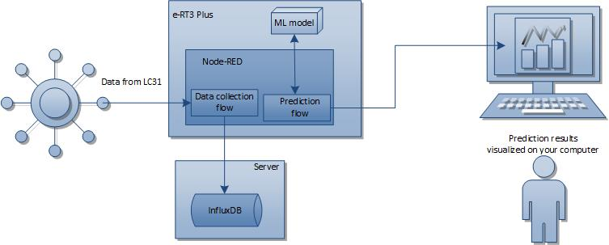

The LC31 module is connected to a pH sensor that sends process data to e-RT3 Plus. Node-RED is installed on e-RT3 Plus and two flows are created. The first flow gathers data from the LC31 module and stores it in InfluxDB. InfluxDB is installed on a server. The second flow uses a machine learning model to predict the downtime of the pH sensor. The results of prediction can be viewed on the Node-RED dashboard.

The following image shows the hardware setup used for this tutorial.

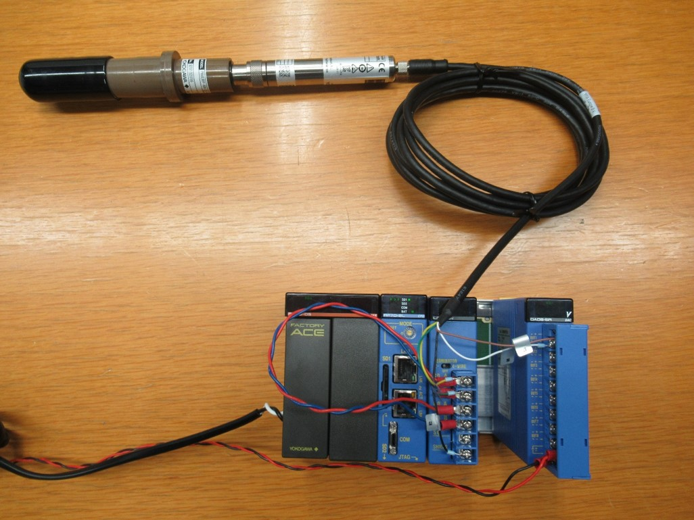

## Workflow

The following figure shows the workflow for predicting the downtime of the pH sensor.
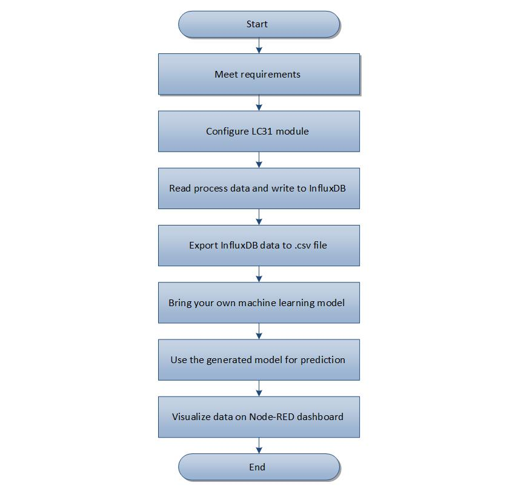

---

## Prerequisites

This tutorial focuses on deploying machine learning models on the [e-RT3 Plus](https://www.yokogawa.com/solutions/products-platforms/control-system/ert3-embedded-controller/ert3-products/ert3-products-cpu/) device. Therefore, you must have a working knowledge of the e-RT3 Plus device and its [supported modules](https://www.yokogawa.com/solutions/products-platforms/control-system/ert3-embedded-controller/ert3-products/) along with machine learning principles, model creation, and Node-RED programming.

Before you start this tutorial, the following requirements must be met:

1. Hardware setup must be complete.
2. InfluxDB must be installed on the server and a database must be created to store the process data.
3. Node-RED must be installed on e-RT3 Plus with the following node modules:
    - m3io nodes
    - InfluxDB nodes
    - Machine learning nodes
    - Node-RED dashboard nodes
4. Docker must be installed and running on the server.

Follow these links for more information on:

- [Installing InfluxDB on the server](https://github.com/Yokogawa-Technologies-Solutions-India/e-RT3-docs/blob/master/Articles/Node-RED/Leveraging-e-RT3-Plus-capabilities-using-Node-RED.md#install-influxdb-and-grafana-on-the-server-pc)
- [Creating a database in InfluxDB](https://github.com/Yokogawa-Technologies-Solutions-India/e-RT3-docs/blob/master/Articles/Node-RED/Leveraging-e-RT3-Plus-capabilities-using-Node-RED.md#create-influxdb-database)
- [Installing Node-RED and m3io nodes on e-RT3 Plus](https://github.com/Yokogawa-Technologies-Solutions-India/e-RT3-docs/blob/master/Articles/Node-RED/Leveraging-e-RT3-Plus-capabilities-using-Node-RED.md#install-node-red-and-m3io-nodes)
- [Installing InfluxDB nodes](https://github.com/Yokogawa-Technologies-Solutions-India/e-RT3-docs/blob/master/Articles/Node-RED/Leveraging-e-RT3-Plus-capabilities-using-Node-RED.md#install-influxdb-nodes)
- [Installing machine learning and dashboard nodes](#install-node-red-machine-learning-and-dashboard-nodes)

### Install Node-RED machine learning and dashboard nodes

To predict the downtime of the pH sensor we use a machine learning model in the Node-RED flow. Therefore, we must install the `node-red-contrib-machine-learning` module which contains a set of nodes that offer machine learning functionalities.

>**Note**: Node-RED must be installed on e-RT3 Plus before you can install the machine learning nodes and Node-RED dashboard.

Follow these steps to install machine learning and dashboard nodes in Node-RED:

1. Open the Node-RED editor.
2. In the upper-right corner, select **Menu > Manage palette**.
   
   The *User Settings* page appears.
3. On the left pane, click the **Palette** tab and then click the **Install** tab.
   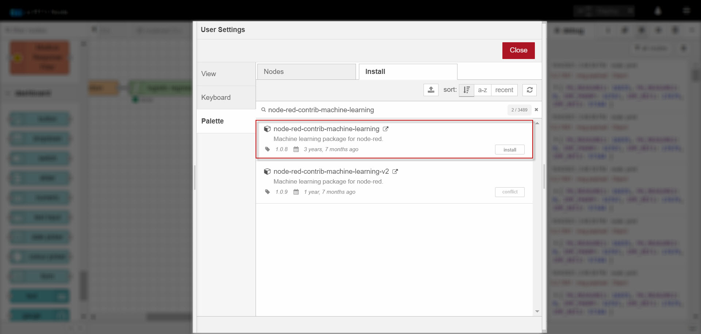
4. In the **search modules** box, type `node-red-contrib-machine-learning`.
5. From the search results that appear, click **Install** next to the `node-red-contrib-machine-learning` module name.
6. In the dialog box that appears, click **Install**.

   The machine learning nodes are installed.
7. In the **search modules** box, type `node-red-dashboard`.
   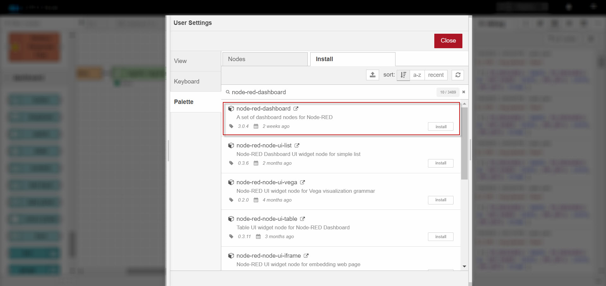
8. From the search results that appear, click **Install** next to the `node-red-dashboard` module name.
9. In the dialog box that appears, click **Install**.

   The dashboard nodes are installed.

---

## Getting Started

After getting the hardware setup ready and installing the required software, we are ready to start programming the e-RT3 Plus device to predict the downtime of the pH sensor.

This tutorial can be broadly divided into three parts:

1. Gathering data for creating a machine learning model
2. Using the collected data to generate a model
3. Using the generated model in e-RT3 Plus for prediction

To predict the downtime of the pH sensor, the following steps must be completed:

   1. [Configuring the LC31 module](#configuring-lc31-module)
   2. [Reading process data and writing it to InfluxDB](#reading-process-data-and-writing-it-to-influxdb)
   3. [Exporting the InfluxDB data to a .csv file](#exporting-the-influxdb-data-to-a-csv-file)
   4. [Bring your own machine learning model](#bring-your-own-machine-learning-model)
   5. [Using the generated model for prediction](#using-the-generated-model-for-prediction)
   6. [Visualizing the prediction and process data on the Node-RED dashboard](#visualizing-the-prediction-and-process-data-on-the-node-red-dashboard)

### Configuring LC31 module

First, we must configure the LC31 module in order to read data from it. The LC31 module enables e-RT3 Plus to be easily connected to external devices such as temperature controllers or pH sensors.

Configuring the LC31 module involves three steps:

1. [Writing the configuration code in Python](#writing-the-configuration-code-in-python)
2. [Transferring the code to the e-RT3 Plus device](#transferring-the-code-to-the-e-rt3-plus-device)
3. [Executing the code on e-RT3 Plus](#executing-the-code-on-e-rt3-plus)

The LC31 module registers are read by using the Modbus protocol. The LC31 module enables us to read the calculated pH, and process values such as impedance by accessing specific registers. By using these process values, we generate the machine learning model.

#### Writing the configuration code in Python

To start reading data from the LC31 module, we must write a Python program that performs the following configurations:

1. Set the power supply of the pH sensor to 4.5V. This is done by writing the value "9000" to channel 1 of the DA module.
2. Provide a delay of 30 seconds to ensure that the startup is complete before configuring the sensor.
3. Configure the Modbus master and communication setting parameter to enable communication.
4. Configure the registers of LC31 module to enable data to be read from the communication table.

To write the values to the necessary registers, we use the m3io library functions.

For more information on the Input/Output relays and registers, refer to the [LC31 User's Manual](https://library.yokogawa.com/document/download/AxkHnJ89/0000033833/3/EN/?_ga=2.86607448.1367174831.1634527556-178228835.1615889230).

The sample code to complete these configurations is as follows.

```python
import ctypes
import time


#Constant declaration
COM_SETTING = 1344      #Communication setting parameters
FUNC_CODE = 4           #Function code
TOP_REG_NUM = 0         #Read first register number
READ_NUM = 25           #Number of read points

#Library load so file
libc = ctypes.cdll.LoadLibrary("/usr/local/lib/libm3.so.1")

#Specify unit 0
c_unit = ctypes.c_int(0)

#Specify slot 2 (for LC31 module)
c_slot = ctypes.c_int(2)

#Creating a short type array with 1 element
short_arr = ctypes.c_short * 1

#Creating a short type array with the number of elements READ_NUM
short_read_num_arr = ctypes.c_short * READ_NUM

#DA- set voltage
c_pos_da = ctypes.c_int(1)      #Writing to channel 1 in DA module
c_num_da = ctypes.c_int(1)      #Number of writing points
c_slot_da = ctypes.c_int(4)     #DA is in slot number 4
data_da = [9000]                #9000 to supply 4.5V
short_arr_da = ctypes.c_short * 1  
c_data_da = short_arr_da(*data_da)
libc.writeM3IoRegister(c_unit, c_slot_da, c_pos_da, c_num_da, c_data_da) 

#Delay for the sensor to start before settings
time.sleep(30)

#Modbus setting- setting LC31 as 'modbus master'
c_pos = ctypes.c_int(9)         #Write register number
c_num = ctypes.c_int(1)         #Number of writing points
data = [0]                      #Write value
short_arr = ctypes.c_short * 1  #Creating a short type array with 1 element
c_data = short_arr(*data)
libc.writeM3IoRegister(c_unit, c_slot, c_pos, c_num, c_data)    

#Modbus settings- communication setting parameters
c_pos = ctypes.c_int(10)         #Write register number
c_num = ctypes.c_int(1)          #Number of writing points
data = [COM_SETTING]             #Write value
c_data = short_arr(*data)        #Store data in short type array
libc.writeM3IoRegister(c_unit, c_slot, c_pos, c_num, c_data)

#Set requirements- turn on Setting Request
c_pos = ctypes.c_int(41)    #Write relay number
c_data = ctypes.c_uint16(0) #Write data (reset)
libc.writeM3OutRelayP(c_unit, c_slot, c_pos, c_data)
c_data = ctypes.c_uint16(1) #Write data
libc.writeM3OutRelayP(c_unit, c_slot, c_pos, c_data)

setting_fin_flg = False
while setting_fin_flg == False:

    #Setting completion status check
    c_pos = ctypes.c_int(9)   #Read relay number
    c_data = short_arr()
    libc.readM3InRelayP(c_unit, c_slot, c_pos, c_data)

    if c_data[0] == 1:
        setting_fin_flg = True

#Setting error status check
c_pos = ctypes.c_int(11)   #Read relay number
c_data = short_arr()
libc.readM3InRelayP(c_unit, c_slot, c_pos, c_data)

if c_data == 1:
    print("SETTING ERROR")

else:
    #Destination slave address code setting
    c_pos = ctypes.c_int(1281)         #Write register number
    c_num = ctypes.c_int(1)            #Number of writing points
    data = [1]                         #Write value
    c_data = short_arr(*data)          #Store data in short type array
    libc.writeM3IoRegister(c_unit, c_slot, c_pos, c_num, c_data)

    #Function code setting
    c_pos = ctypes.c_int(1289)         #Write register number
    c_num = ctypes.c_int(1)            #Number of writing points
    data = [FUNC_CODE]                 #Write value
    c_data = short_arr(*data)          #Store data in short type array
    libc.writeM3IoRegister(c_unit, c_slot, c_pos, c_num, c_data)

    #First register number setting
    c_pos = ctypes.c_int(1290)         #Write register number
    c_num = ctypes.c_int(1)            #Number of writing points
    data = [TOP_REG_NUM]               #Write value
    c_data = short_arr(*data)          #Store data in short type array
    libc.writeM3IoRegister(c_unit, c_slot, c_pos, c_num, c_data)

    #Read point setting
    c_pos = ctypes.c_int(1291)         #Write register number
    c_num = ctypes.c_int(1)            #Number of writing points
    data = [READ_NUM]                  #Write value
    c_data = short_arr(*data)          #Store data in short type array
    libc.writeM3IoRegister(c_unit, c_slot, c_pos, c_num, c_data)

    #Send request
    c_pos = ctypes.c_int(49)    #Write relay number
    c_data = ctypes.c_uint16(0) #Write data (reset)
    libc.writeM3OutRelayP(c_unit, c_slot, c_pos, c_data)
    c_data = ctypes.c_uint16(1) #Write data
    libc.writeM3OutRelayP(c_unit, c_slot, c_pos, c_data)

    resp_fin_flg = False
    resp_error_flg = False
    while resp_fin_flg == False:

        #Response request status confirmation
        c_pos = ctypes.c_int(17)   #Read relay number
        c_data = short_arr()
        libc.readM3InRelayP(c_unit, c_slot, c_pos, c_data)

        if c_data[0] == 1:
            resp_fin_flg = True

        else:
            #Request error status check
            c_pos = ctypes.c_int(18)   #Read relay number
            c_data = short_arr()
            libc.readM3InRelayP(c_unit, c_slot, c_pos, c_data)

            if c_data[0] == 1:
                resp_fin_flg = True
                resp_error_flg = True

    if resp_error_flg == True:
        print("REQUEST ERROR")
    
    else:
        print("Success!")
```

#### Transferring the code to the e-RT3 Plus device

Once you have completed writing the Python code, save the file and transfer it to the e-RT3 Plus device by using WinSCP.

For more information on transferring files by using WinSCP, refer to [Using WinSCP to transfer files to e-RT3 Plus](https://github.com/Yokogawa-Technologies-Solutions-India/e-RT3-docs/blob/master/Articles/AI/Sample_AI_Application.md#using-winscp-to-transfer-files-to-e-rt3-plus).

#### Executing the code on e-RT3 Plus

Now, we must execute the Python code to enable data to be read from the LC31 module.

Follow these steps to execute the Python code:

1. Open an SSH terminal to the e-RT3 Plus device.

   For more information about connecting to e-RT3 Plus using SSH, refer to [Remote Communication with e-RT3 Plus](https://github.com/Yokogawa-Technologies-Solutions-India/e-RT3-docs/blob/master/Articles/e-RT3/Communication-with-e-RT3-Plus.md#communicating--with-e-rt3-plus-by-ssh).

2. Use the `cd` command to navigate to the directory in which you copied the Python code.
3. Run the following command to execute the Python code.

    ```bash
    python3 {FILENAME_OF_PYTHON_CODE}.py
    ```

    Here, `FILENAME_OF_PYTHON_CODE` refers to the filename of the Python code which you have just copied to the device.

    If the message "Success!" is displayed, we can start reading data from the LC31 module. If the message "REQUEST ERROR" is displayed, the configuration has failed, or if the message "SETTING ERROR" is displayed, it indicates an error in the settings.

### Reading process data and writing it to InfluxDB

In this section, we create a Node-RED flow that reads data from the LC31 module and writes it to InfluxDB in the appropriate format. We will read two pH measurements, an oxidation-reduction potential measurement, and two impedance measurements.

Follow these steps to create a Node-RED flow that reads data from the LC31 module registers and writes it to InfluxDB:

1. Open the Node-RED editor.
2. To read data from the LC31 module every ten seconds, select the **inject** node and configure its properties.
   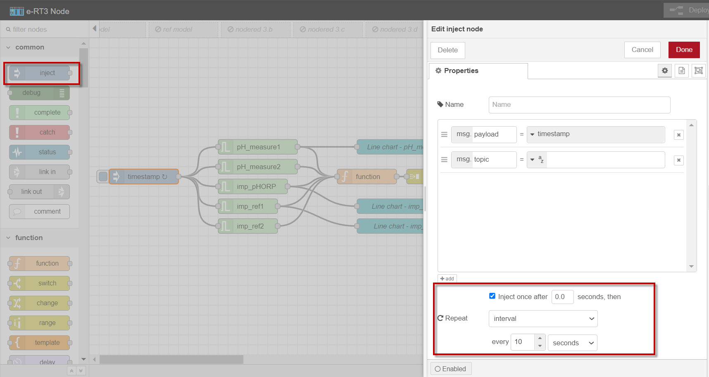
3. To refresh the data in the LC31 module on every read attempt, perform these steps:
   1. Open a text file on your computer and write the following Python code.

      ```python
      import ctypes

      libc = ctypes.cdll.LoadLibrary("/usr/local/lib/libm3.so.1")

      #Specify unit 0
      c_unit = ctypes.c_int(0)

      #Specify slot 2 (for LC31 module)
      c_slot = ctypes.c_int(2)

      #Creating a short type array with 1 element
      short_arr = ctypes.c_short * 1

      c_pos = ctypes.c_int(49)    #Write relay number
      c_data = ctypes.c_uint16(0) #Write data (reset)
      libc.writeM3OutRelayP(c_unit, c_slot, c_pos, c_data)
      c_data = ctypes.c_uint16(1) #Write data
      libc.writeM3OutRelayP(c_unit, c_slot, c_pos, c_data)

      resp_fin_flg = False
      resp_error_flg = False
      while resp_fin_flg == False:

         #Response request status confirmation
         c_pos = ctypes.c_int(17)   #Read relay number
         c_data = short_arr()
         libc.readM3InRelayP(c_unit, c_slot, c_pos, c_data)

         if c_data[0] == 1:
            resp_fin_flg = True

         else:
            #Request error status check
            c_pos = ctypes.c_int(18)   #Read relay number
            c_data = short_arr()
            libc.readM3InRelayP(c_unit, c_slot, c_pos, c_data)

            if c_data[0] == 1:
                  resp_fin_flg = True
                  resp_error_flg = True

      if resp_error_flg == True:
         print("REQUEST ERROR")

      else:
         print("REQUEST SUCCESSFUL")
      ```

   2. Save the file as `<YOUR_READREQ_FILENAME>.py`.

      Here, `YOUR_READREQ_FILENAME` refers to the name of the Python file.
   3. Copy the file to the e-RT3 Plus device by using WinSCP.
      >**Note**: For more information on transferring files by using WinSCP, refer to [Using WinSCP to transfer files to e-RT3 Plus](https://github.com/Yokogawa-Technologies-Solutions-India/e-RT3-docs/blob/master/Articles/AI/Sample_AI_Application.md#using-winscp-to-transfer-files-to-e-rt3-plus).
   4. On the left pane, expand **function**, select the **exec** node, and drag it to the work area.
   5. Double-click the created node.

        The *Edit exec node* pane appears.
        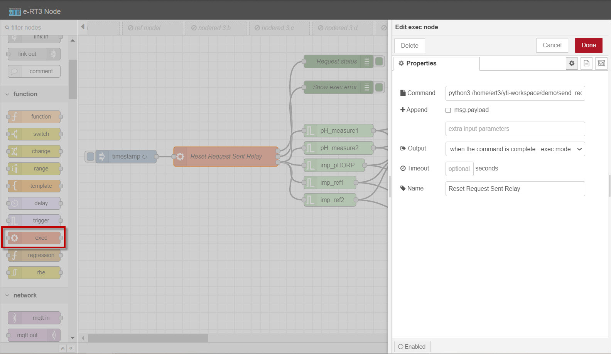

   6. In the **Command** box, specify the following command.

      ```bash
      python3 <PYTHONCODE_FILEPATH>/<YOUR_READREQ_FILENAME>.py
      ```

      Here,

      `PYTHONCODE_FILEPATH` refers to the location in the e-RT3 Plus device which you have copied the Python code.

      `YOUR_READREQ_FILENAME` refers to the name of the Python file.

      This command runs the Python code to refresh the data in the LC31 module on every read attempt.

   7. From the **Output** drop-down list, select **when the command is complete-exec mode**.
   8. In the **Name** box, specify the name of the node.
   9. In the upper-right corner of the *Edit exec node* pane, click **Done**.
4. To read the pH value from the LC31 module register, perform these steps:
   1. On the left pane, expand **m3io**, select the **readM3IoRegister** node, and drag it to the work area.
   2. Double-click the created node.

      The *Edit readM3ioRegister node* pane appears.
      
   3. In the **Name** box, specify the name measurement parameter.
   4. In the **Unit** box, specify the e-RT3 Plus base module number to which the module is connected. Since we have only one unit in the setup, the value is set to 0.
   5. In the **Slot** box, specify the slot number in which the module is connected.
   6. In the **Position** box, specify the position of the register from which you want to read data. The first pH value must be read from register 1544.
   7. In the upper-right corner of the *Edit readM3IoRegister node* pane click **Done**.
5. Repeat step 4 to add nodes to read each of the following measurement values from the registers of the LC31 module:
    | **Measurement** |**Type** |**Register address** |
    |---|---|---|
    | pH_measure2 | Second pH measurement |1555 |
    | imp_pHORP |Oxidation-reduction potential |1558 |
    | imp_ref1 |First impedance measurement |1560 |
    | imp_ref2 |Second impedance measurement |1561 |

    For more information on the registers, refer to the [LC31 User's Manual](https://library.yokogawa.com/document/download/AxkHnJ89/0000033833/3/EN/?_ga=2.86607448.1367174831.1634527556-178228835.1615889230).

6. To assign names to each register, perform these steps:
   1. On the left pane, expand **function**, select the **function** node, and drag it to the work area.
   2. Double-click the created node.

        The *Edit function node* pane appears.
        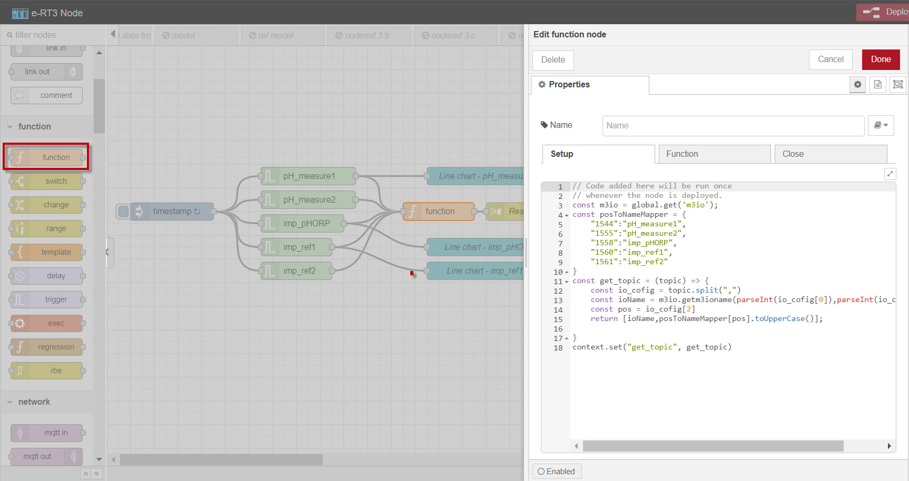
   3. Click the **Setup** tab, and type the following code in the editor.

      ```javascript
        const m3io = global.get('m3io');
        const posToNameMapper = {
            "1544":"pH_measure1",
            "1555":"pH_measure2",
            "1558":"imp_pHORP",
            "1560":"imp_ref1",
            "1561":"imp_ref2"
        }
        const get_topic = (topic) => {
            const io_cofig = topic.split(",")
            const ioName = m3io.getm3ioname(parseInt(io_cofig[0]),parseInt(io_cofig[1]));
            const pos = io_cofig[2]
            return [ioName,posToNameMapper[pos].toUpperCase()];

        }
        context.set("get_topic", get_topic)
      ```

   4. Click the **Function** tab and type the following code in the editor.

      ```javascript
        const new_topic_data = context.get("get_topic")(msg.topic)
        msg[new_topic_data[0]] = new_topic_data[1]
        return msg;
      ```

   5. In the upper-right corner of the *Edit function node* pane, click **Done**.

7. To create a key-value pair of the register name and its value, and send the object with the set of five register values, perform these steps:
   1. On the left pane, expand **sequence**, select the **join** node, and drag it to the work area.
   2. Double-click the created node.

        The *Edit join node* pane appears.
        
   3. From the **Mode** drop-down list, select **manual**.
   4. From the **Combine each** drop-down list, select **msg**, and then type `payload` in the adjacent box.
   5. From the **to create** drop-down list, select **a key/Value Object**.
   6. In the **using the value of** box, type `LC31`.
   7. In the **After a number of message parts** box, type `5`.
   8. In the upper-right corner of the *Edit join node* pane, click **Done**.
8. To write the data to InfluxDB, perform these steps:
   1. On the left pane, expand **storage**, select the **influxdb out** node, and drag it to the work area.
   2. Double-click the created node.

      The *Edit influxdb out node* pane appears.
      
   3. In the **Name** box, specify the name of the node.
   4. Next to the **Server** drop-down list, click the **Edit** icon, and specify the following on the page that appears:
       - In the **Name** box, specify a name for the server.
       - In the **URL** box, specify the URL in the following format:

         `http://<SERVER_IP_ADDRESS>:<PORT_NUMBER>`

         Here,

         `<SERVER_IP_ADDRESS>` refers to the IP address of the server on which the database is hosted.

         `<PORT_NUMBER>` refers to the port number to access the database.
       - In the upper-right corner of the *Edit influxdb out node* pane, click **Update**.
   5. In the **Database** box, specify the name of the InfluxDB database you created.
   6. In the **Measurement** box, specify the name of the measurement that is written to the database.
   7. In the upper-right corner of the *Edit influxdb out node* pane, click **Done**.
9. To display the first pH measurement as a trend on the Node-RED dashboard, perform these steps:
   1. On the left pane, expand **dashboard**, select the **chart** node, and drag it to the work area.
   2. Double-click the created node.

      The *Edit chart node* pane appears.
      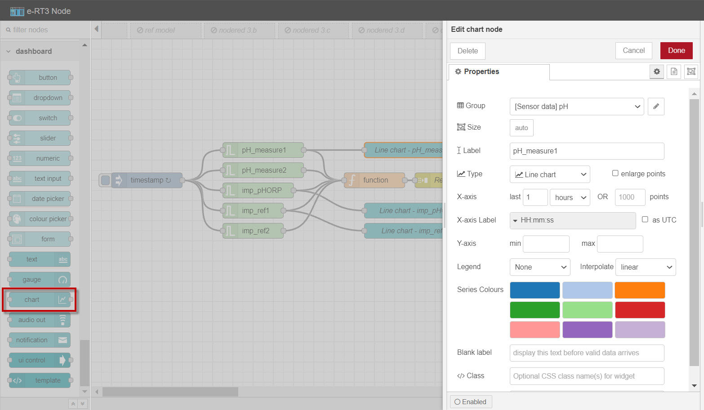
   3. Click the **Edit** icon next to the **Group** drop-down list and configure the properties as follows:
      1. In the **Name** box, specify the name of the chart.
      2. From the **Tab** drop-down list, select the name of the dashboard on which you want to display the chart.
            > **Note:** If you are configuring the first element of the dashboard, click the **Edit** icon next to the **Tab** drop-down list and configure the dashboard settings.
      3. In the **Width** box, specify the width of the line chart.
      4. Select the **Display group name** check box.
      5. In the upper-left corner of the *Edit chart node* pane, click **Update**.
10. Repeat step 9 to add charts to monitor the trend of the remaining impedance and pH measurements.

11. To display the process data being written to InfluxDB on the debug pane, perform these steps:
    1. On the left pane, select the **debug** node, and drag it onto the work area.
    2. Double-click the created node.

         The *Edit debug node* pane appears.
    3. From the **Output** drop-down list, select **msg**, and then type `payload` in the adjacent box.
    4. In the **To** section, select the **debug window** check box.
    5. In the **Name** box, specify a name for the node.
    6. In the upper-right corner of the *Edit debug node* pane, click **Done**.

12. Now that all the necessary nodes are available on the work area, connect the nodes to create the final flow. The final flow should look something like this.

    

13. On the menu bar, click **Deploy** to activate the flow.

    The data from the registers of the LC31 module are read and stored in InfluxDB.

14. In the upper-right corner of the Node-RED editor, click the **Debug** tab.
   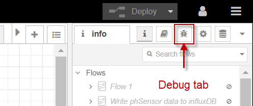

The debug pane appears, displaying the values written to InfluxDB.

### Exporting the InfluxDB data to a .csv file

Now we must export InfluxDB data to a .csv file so that it can be used to train and test the machine learning model.

To learn how to export data from InfluxDB to a .csv file, refer to [Exporting data from InfluxDB to a .csv file](https://github.com/Yokogawa-Technologies-Solutions-India/e-RT3-docs/blob/master/Articles/Node-RED/Achieving_AI_Prediction_using_e-RT3_Plus.md#exporting-the-data-from-influxdb-to-a-csv-file).

### Bring your own machine learning model

With the data exported to the .csv file, you can now build, train, and create a model. You can build your own machine learning model using any of the model creation methods, or you can use the [sample model](https://github.com/Yokogawa-Technologies-Solutions-India/e-RT3-docs/blob/master/Libraries/sample-model/lr_model.b) created for predicting the downtime of the pH sensor. BYOML is a useful feature that helps you to use your own machine learning model on e-RT3 Plus.

>**Note**: The model provided is for sample usage and does not include support.

Since we will be executing the ML model on e-RT3 Plus, it is necessary to verify if the model is compatible with the python3 packages installed on e-RT3 Plus.

To view the versions of the python3 packages installed on e-RT3 Plus, establish an SSH connection and run the following command.

```bash
pip3 list
```

Follow these steps to create a model:

1. Use the data exported into the .csv file to prepare the training and testing data (train.csv and test.csv).

   >**Note**: To prepare the training and testing data, we use only two columns, "imp_pHORP" and "imp_ref1", in the .csv files. Additionally, a third column `LABEL` is added which indicates the operational status of the pH sensor. The value `1` in the `LABEL` column indicates that the sensor is in good operating condition and `0` indicates the downtime of the sensor.

2. Prepare a `requirements.txt` file to specify the environment information in the following format:

   ```bash
   numpy==1.13.3
   pandas==0.22.0
   scikit-learn==0.19.1
   scipy==0.19.1
   ```
  
   >**Note**: It is important to note that, the environment in which the model is created must match the execution environment.

3. Create a file with the following Python code to train and create the machine learning model.

   ```python
   # import required libraries
   import numpy as np
   import pandas as pd
   from sklearn.metrics import confusion_matrix, classification_report
   from sklearn.metrics import accuracy_score
   from sklearn.linear_model import LogisticRegression
   import pickle
   import sys
   import warnings
   import os

   # turn off warnings
   if not sys.warnoptions:
      warnings.simplefilter("ignore")
      os.environ["PYTHONWARNINGS"] = "ignore"

   # read training and testing data
   train_df=pd.read_csv('train.csv')
   test_df=pd.read_csv('test.csv')

   # create training, testing- features(X) and labels(y)
   X_train=train_df.drop('LABEL',axis=1)
   y_train=train_df['LABEL']

   X_test=test_df.drop('LABEL',axis=1)
   y_test=test_df['LABEL']

   # train model on training data
   model=LogisticRegression(random_state=42,C= 100, penalty='l2', solver= 'newton-cg')
   model.fit(X_train,y_train)

   # get predictions on test data
   y_pred = model.predict(X_test)

   # print classification report
   print("Classification report:")
   print(classification_report(y_test, y_pred))

   # print confusion matrix
   print("Confusion matrix:")
   print(confusion_matrix(y_test, y_pred))

   # print accuracy
   print("Accuracy = {} %".format(np.round(accuracy_score(y_test, y_pred)*100,2)))

   # save the model
   filename = 'lr_model.b'
   pickle.dump(model, open(filename, 'wb'))
   ```

4. Save the file as `model.py`.
5. Create a file with the following Docker commands and save it as `Dockerfile`.

   ```bash
   FROM python:3.6

   RUN mkdir <DOCKER_WORKING_DIRECTORY>
   VOLUME <DOCKER_WORKING_DIRECTORY>

   WORKDIR <DOCKER_WORKING_DIRECTORY>
   COPY . .
   RUN pip install -r requirements.txt
   CMD ["python3", "model.py"]
   ```

   Here, `<DOCKER_WORKING_DIRECTORY>` refers to the specified working directory in the Docker environment.

   >**Note**: Ensure that requirements.txt, train.csv, test.csv, Dockerfile, and model.py are saved in a common folder.

6. Start Command Prompt.

   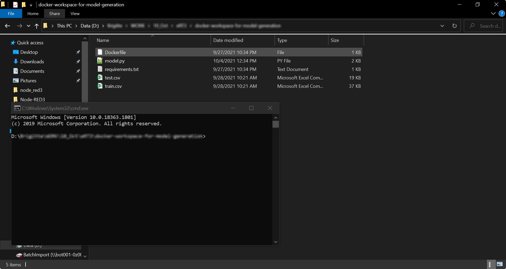

7. Navigate to the directory in which the files are saved.
8. Run the following command to build the model image.

   ```bash
   docker build -t <IMAGE_NAME> .
   ```

   Here, `<IMAGE_NAME>` refers to the name of the image.

9. Run the following command to create a model with the specified environment settings:

   ```bash
   docker run --rm -v <ML_MODEL_FILEPATH>:<DOCKER_WORKING_DIRECTORY> --name <IMAGE_NAME> <IMAGE_NAME>
   ```

   Here,

   `<ML_MODEL_FILEPATH>` refers to the folder where you want to save the generated model.

   `<DOCKER_WORKING_DIRECTORY>` refers to the working directory in the Docker environment.

   `<IMAGE_NAME>` refers to the name of the image.

   The model `lr_model.b` is created in the specified location.

10. Copy the model to the e-RT3 Plus device by using WinSCP.

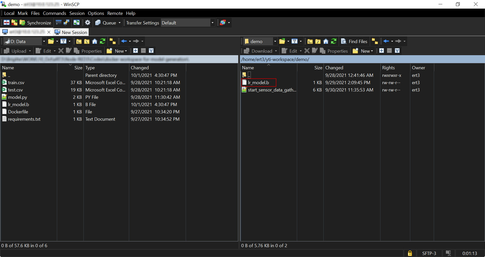

For more information on transferring files by using WinSCP, refer to [Using WinSCP to transfer files to e-RT3 Plus](https://github.com/Yokogawa-Technologies-Solutions-India/e-RT3-docs/blob/master/Articles/AI/Sample_AI_Application.md#using-winscp-to-transfer-files-to-e-rt3-plus).

### Using the generated model for prediction

Now that we have the machine learning model ready, we can use it in a Node-RED flow to predict the downtime of the pH sensor. In this flow, we read the oxidation-reduction potential measurement and the impedance measurement (register 1558 and 1560), which were used while generating the model, and perform prediction accordingly.

Follow these steps to create a Node-RED flow that uses a machine learning model to predict the downtime of the pH sensor:

1. Open the Node-RED editor.
2. To read data from the LC31 module every ten seconds, select the **inject** node and configure its properties.
3. To read the impedance process values in registers 1558 and 1560, follow step 4 of the [data gathering flow](#reading-process-data-and-writing-it-to-influxdb).
4. To create an array of the process values read in the previous step, perform these steps:
   1. On the left pane, expand **sequence**, select the **join** node, and drag it to the work area.
   2. Double-click the created node.

        The *Edit join node* pane appears.
   3. From the **Mode** drop-down list, select **manual**.
   4. From the **Combine each** drop-down list, select **msg**, and then type `payload` in the adjacent box.
   5. From the **to create** drop-down list, select **an Array**.
   6. In the **After a number of message parts** box, type `2`.
   7. In the upper-right corner of the *Edit join node* pane, click **Done**.
5. To add the array created in the previous step as the payload of the returned message, perform these steps:
   1. On the left pane, expand **function**, select the **function** node, and drag it to the work area.
   2. Double-click the created node.

        The *Edit function node* pane appears.
   3. Click the **Function** tab, and type the following code in the editor.

      ```javascript
        const features=msg.payload
        const toArray=[]
        toArray.push(features)
        msg={
            payload:toArray
        }
        return msg;
      ```

   4. In the upper-right corner of the *Edit function node* pane, click **Done**.
6. To use the model generated in the [previous section](#bring-your-own-machine-learning-model), perform these steps:
   1. On the left pane, expand **machine learning**, select the **predictor** node, and drag it to the work area.
   2. Double-click the created node.

        The *Edit predictor node* pane appears.
        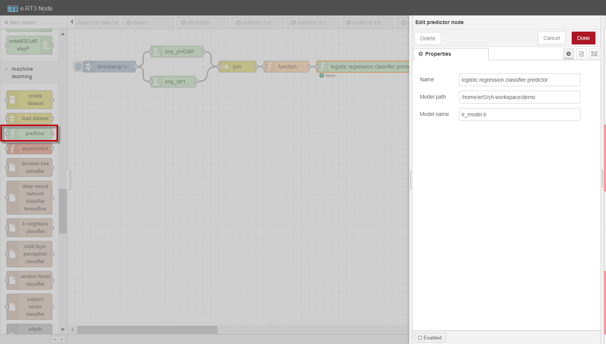
   3. In the **Name** box, specify a name for the node.
   4. In the **Model path** box, specify the location of the folder that contains the model.
   5. In the **Model name** box, specify the name of the model to be used.
   6. In the upper-right corner of the *Edit predictor node* pane, click **Done**.
7. To interpret the results of the prediction, use the **function** node again, and specify the following code in the **Function** tab:

    ```javascript
    status = ""
    if (msg.payload ==0) {
    status = "NG";
    } else {
    status = "OK";
    }
    msg= {
        payload:status
    }
    return msg;
    ```

    Here, a message payload value of zero indicates that the sensor is not performing as expected and a payload value of one indicates that the sensor is in good operating condition.
8. To display the result in a user-friendly format, perform these steps:
   1. On the left pane, expand **function**, select the **template** node, and drag it to the work area.
   2. Double-click the created node.

      The *Edit template node* pane appears.
      
   3. From the **Property** drop-down list, select **msg.** and then type `payload` in the adjacent box..
   4. From the **Syntax Highlight** drop-down list, select **mustache**.
   5. In the **Template** editor, type the following:

      ```bash
      Predicted class= {{payload}} ! 
      ```

   6. From the **Format** drop-down list, select **Mustache template**.
   7. From the **Output as** drop-down list, select **Plain text**.
   8. In the upper-right corner of the *Edit template node* pane, click **Done**.
9. To display the status of prediction as a gauge on the dashboard, perform these steps:
    1. On the left pane, expand **dashboard**, select the **gauge** node, and drag it to the work area.
    2. Double-click the created node.

         The *Edit gauge node* pane appears.
         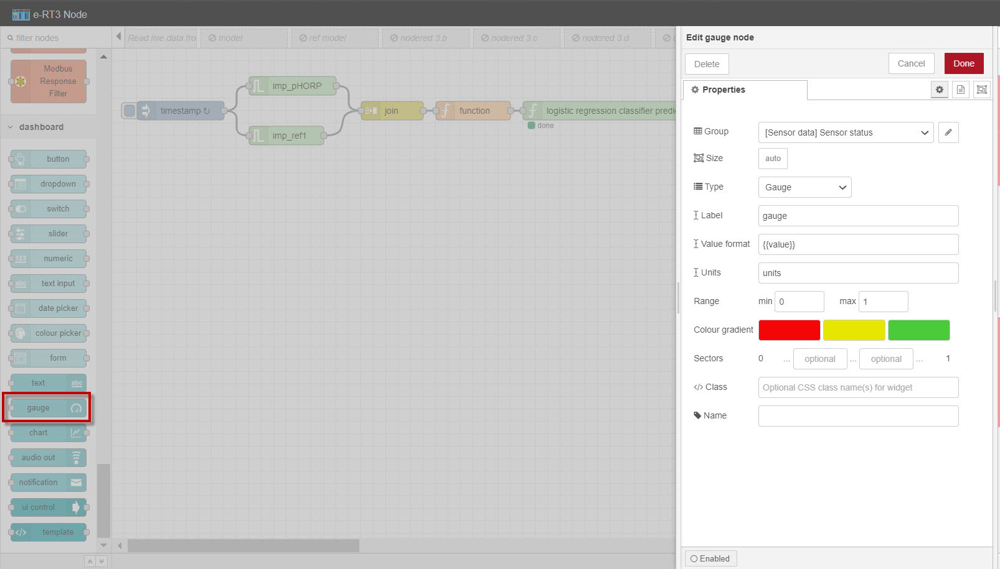
    3. Click the **Edit** icon next to the **Group** drop-down list, and configure the properties as shown in step 9.3 of [data gathering flow](#reading-process-data-and-writing-it-to-influxdb).
    4. From the **Type** drop-down list, select **Gauge**.
    5. In the **Label** box, specify the name of the chart.
    6. In the **Value format** box, type `{{value}}` to specify the value shown on the gauge.
    7. In the **Units** box, specify the unit of measurement. For example, ohm, volt.
    8. In the **Range** box, specify the range as 0 to 1.
    9. In the upper-right corner of the *Edit gauge node* pane, click **Done**.

10. To display the result of the prediction on the dashboard, perform these steps:
    1. On the left pane, expand **dashboard**, select the **text** node, and drag it to the work area.
    2. Double-click the created node.

         The *Edit text node* pane appears.
         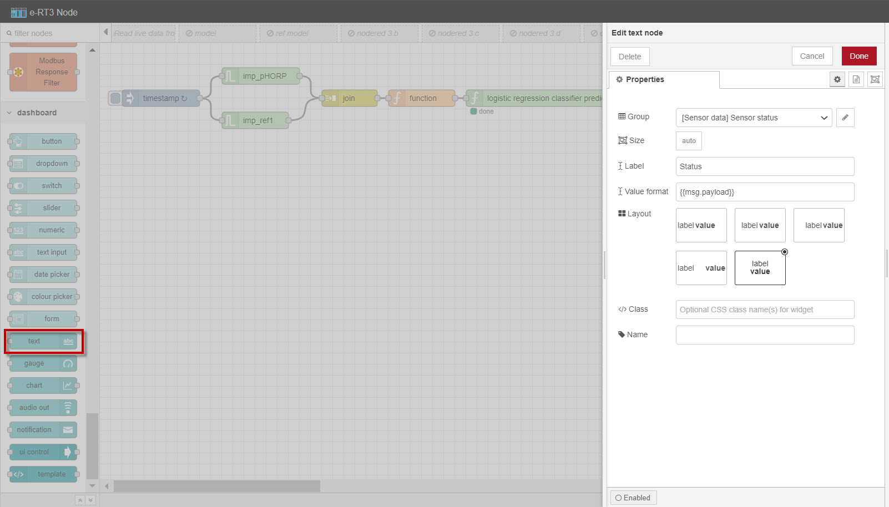
    3. From the **Group** drop-down list, select **[Sensor data] Sensor status**.
    4. In the **Label** box, specify the name of the chart.
    5. In the **Value format** box, type `{{msg.payload}}` to display the prediction result on the chart.
    6. In the **Layout** section, select a layout of your choice.
    7. In the upper-right corner of the *Edit text node* pane, click **Done**.
11. To display the predicted class on the debug pane, perform these steps:
    1. On the left pane, select the **debug** node, and drag it onto the work area.
    2. Double-click the created node.

         The *Edit debug node* pane appears.
    3. From the **Output** select **msg**, and then type `payload` in the adjacent box.
    4. In the **To** section, select the **debug window** check box.
    5. In the **Name** box, specify a name for the node.
    6. In the upper-right corner of the *Edit debug node* pane, click **Done**.
12. Repeat step 11 to add a debug node for an error scenario.
13. Now that all the necessary nodes are available on the work area, connect the nodes to create the final flow. The final flow should look something like this.

    

14. On the menu bar, click **Deploy** to activate the flow.

    The process values are read and the model predicts the downtime of the pH sensor.

15. In the upper-right corner of the Node-RED editor, click the **Debug** tab.

   The debug pane appears, displaying the predicted class. A predicted class of `1` indicates that the sensor is in good operating condition and `0` indicates the downtime of the sensor.

### Visualizing the prediction and process data on the Node-RED dashboard

The results of the prediction flow can be visualized on the Node-RED dashboard.

Follow these steps to view the prediction results:

1. Open a web browser.
2. In the address bar, type the URL of the Node-RED dashboard in the following format:

   `http://<ERT3PLUS_IP_ADDRESS>:<PORT_NUMBER>/ui/`

   Here,

   `<ERT3PLUS_IP_ADDRESS>` refers to the IP address of the e-RT3 Plus device.

   `<PORT_NUMBER>` refers to the port number to access Node-RED. The default port number is `1880`.

   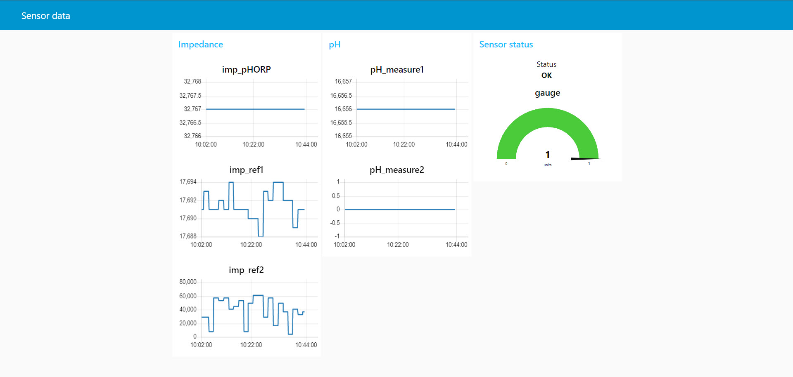

The Node-RED dashboard page appears, displaying the results of the prediction and the trend of the process values. If the status is displayed as "OK", it indicates that the pH sensor is in good operating condition. On the contrary, a status "NG" indicates the downtime of the pH sensor.

---

## Conclusion

The e-RT3 Plus device effectively uses the machine learning models to correctly predict the downtime of the pH sensor, thus proving to be a versatile controller that can be easily used to create ML-based solutions.

---

## References

1. [Deploying a sample AI application on e-RT3 Plus](https://github.com/Yokogawa-Technologies-Solutions-India/e-RT3-docs/blob/master/Articles/AI/Sample_AI_Application.md)
2. [Leveraging e-RT3 Plus capabilities using Node-RED](https://github.com/Yokogawa-Technologies-Solutions-India/e-RT3-docs/blob/master/Articles/Node-RED/Leveraging-e-RT3-Plus-capabilities-using-Node-RED.md#install-influxdb-and-grafana-on-the-server-pc)
3. [Achieving AI Prediction using e-RT3 Plus](https://github.com/Yokogawa-Technologies-Solutions-India/e-RT3-docs/blob/master/Articles/Node-RED/Achieving_AI_Prediction_using_e-RT3_Plus.md#exporting-the-data-from-influxdb-to-a-csv-file)
4. [Communication with e-RT3 Plus (remote)](https://github.com/Yokogawa-Technologies-Solutions-India/e-RT3-docs/blob/master/Articles/e-RT3/Communication-with-e-RT3-Plus.md#communicating--with-e-rt3-plus-by-ssh)
5. [LC31 User's Manual](https://library.yokogawa.com/document/download/AxkHnJ89/0000033833/3/EN/?_ga=2.86607448.1367174831.1634527556-178228835.1615889230)

---
